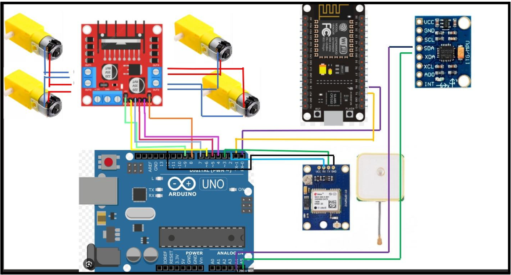
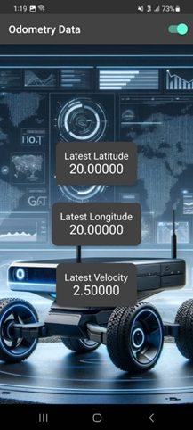
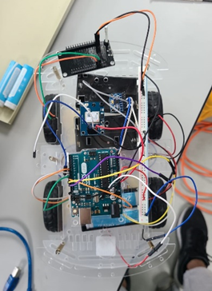

# Autonomous four-wheel robot
Project for Industrial Automation Class in Tec of Monterrey. This project showcases a wheel robot designed with pre-loaded path planning capabilities. Our primary goal is to demonstrate key concepts and apply the knowledge we've gained in our coursework.

<div style="display: flex; justify-content: space-around;">

</div>


## Prerequisites
To effectively use, modify, or further develop this project, you'll need to set up your environment with the following tools and resources:

1. **Git**: Version control system essential for managing and tracking changes in the project. [Download Git](https://git-scm.com/downloads).
2. **GitHub**: Platform for hosting and collaborating on Git repositories. [Sign up or log in to GitHub](https://github.com/).
3. **Visual Studio Code (VS Code)**: A powerful and versatile code editor. [Download VS Code](https://code.visualstudio.com/Download).
4. **Arduino IDE**: Integrated development environment for Arduino programming. [Download Arduino IDE](https://www.arduino.cc/en/software).
5. **Arduino VS Code Extension**: Enhances Arduino programming capabilities in VS Code. Install from the VS Code Extensions marketplace.
6. **Arduino Libraries**: Essential libraries for Arduino development. They can be installed directly through the Arduino IDE.
7. **Flutter**: UI toolkit for building natively compiled applications. Note: Use Windows for Android development and MacOS for iOS development. [Download Flutter](https://flutter.dev/docs/get-started/install).


With these tools installed, you'll be equipped to work seamlessly on the SmartSprinkler project and bring your innovative ideas to life.

## Project Highlights

### Mobile App Interface
Get a glimpse of our user-friendly and intuitive mobile application, designed for both Android and iOS platforms.




### Real Prototype
Discover the tangible realization of our project in the real prototype of the wheel robot.



## Project Improvement Opportunities

### Real Prototype Enhancements

- **Improved Connection Management**: A key area for enhancement in the real prototype is the management of connections. Moving away from the extensive use of jumpers, we could adopt structured cabling practices. This includes techniques like cable braiding, cable bundling, and strategic positioning of cables to enhance organization, reduce clutter, and improve the overall reliability and aesthetics of the prototype.

### Code Enhancements
- The final version of the Arduino code (`_codigos_arduino>arduinoFull>arduinoFull.ino_`) currently relies on odometry rather than GPS data for calculations. Although the yaw angle data is available, it was not utilized in the final presentation. Earlier versions of the code utilized these values to compute displacement, velocity, and direction. Due to time constraints, this data was not included in the final version. However, the earlier codes are functional and can be utilized separately. Future development should focus on integrating these components for a comprehensive understanding.

### Control System Development
- The robot was intended to use a PID controller for velocity control. However, the initial tests for plant identification were not satisfactory. To improve this, we suggest the following steps:
    1. **Pulse Width Response Test**: Implement a specific code on this UGV to perform a pulse width response test. This test is crucial to understand how the wheels react to different control signals.
    2. **Analysis with Matlab and PID Tuner**: Post data collection, utilize Matlab and the PID Tuner add-on. By inputting our test data into this software, we can model our system's (the "plant") behavior with high accuracy.
    3. **Selection and Tuning of a PI Controller**: Based on the model, select a Proportional-Integral (PI) controller. Adjust the controller's parameters for a system response time of 500 milliseconds, which is vital for the Arduino controller's effective speed management.
    4. **Implementation in the Arduino Code**: Implement the optimal PI controller values in the Arduino's full code using the Arduino PID library, which simplifies integrating PI controller calculations.

### Mobile App Functionalities
- Additional features could enhance the mobile app interface:
    - A "Reset" function to initiate a new sequence.
    - An "Emergency Stop" feature.
    - An input field for velocity, displaying possible min and max values.
    - Alert messages like "No GPS available".

### Suggested Code Structure
```cpp
// Define enum for possible states
while (GPS info is available) {
    // Handle requests from app via HTTP
    // Compute angle and velocity
    // Switch case for state
        // Handle logic for each state
}

// Functions as needed
